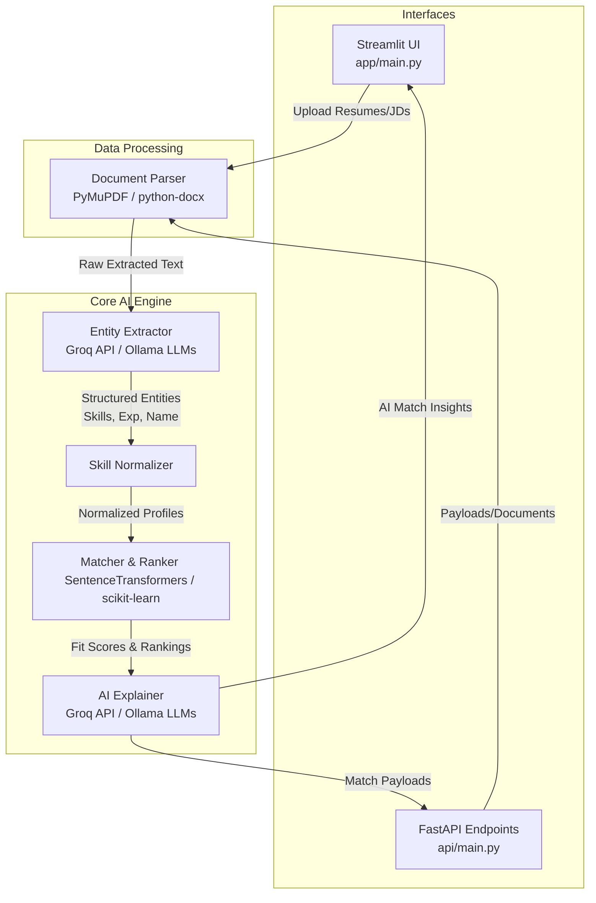

# AI-Driven Applicant Tracking System (ATS)

## Overview
This AI-powered Recruitment Engine and Applicant Tracking System (ATS) automates the process of parsing resumes, extracting structured data, and accurately matching candidates against job descriptions. It provides both a rich **Streamlit** user interface and a robust **FastAPI** backend. 

Powered by state-of-the-art Large Language Models (via **Groq API** and local **Ollama** models like Gemma) and local embedding models, it scores, ranks, and provides AI-generated explanations for candidate-to-job fits.

## Live Demo
**Demo**


## Architecture



## Core Features
1. **Intelligent Document Parsing:** Seamlessly extracts text from both PDF and DOCX formats.
2. **LLM Entity Extraction:** Leverages modern Large Language Models through the blazing fast **Groq API** or locally hosted via **Ollama** (e.g., Gemma 2b or Llama 3) to accurately extract candidate details, years of experience, and hard/soft skills from unstructured text.
3. **Semantic Skill Matching:** Uses `sentence-transformers` for deep semantic similarity matching of candidate skills to job description requirements, rather than relying on exact keyword matching.
4. **Weighted Candidate Ranking:** Employs a multi-factor ranking algorithm considering skill overlap, functional experience gaps, and contextual keyword matches.
5. **AI Match Explanation:** Generates human-readable, AI-backed feedback detailing exactly *why* a candidate is a good (or poor) fit, mitigating black-box AI concerns.
6. **Robust Interfaces:** Contains a completely functioning **Streamlit** web application for HR professionals, and a **FastAPI** application for integration with other enterprise tools.

## Setup & Installation

1. **Clone the repository:**
   ```bash
   git clone https://github.com/raghavendranhp/AI_driven_Applicant_Tracking_System.git
   cd AI_driven_Applicant_Tracking_System
   ```
2. **Set up the virtual environment:**
   ```bash
   python -m venv ats_venv
   # On Windows:
   ats_venv\Scripts\activate
   # On macOS/Linux:
   source ats_venv/bin/activate
   ```
3. **Install Dependencies:**
   ```bash
   pip install -r requirements.txt
   ```
4. **Environment Variables:**
   Create a `.env` file in the root directory and add your required configuration details:
   ```env
   GROQ_API_KEY=your_groq_api_key_here
   # Include any specific Ollama host URLs if running a remote daemon
   ```

## Usage

### Launching the Streamlit User Interface
```bash
streamlit run app/main.py
```
*Provides tabs for "Single Resume Analysis" and "Batch Resume Ranking".*

### Launching the FastAPI Server
```bash
uvicorn api.main:app --reload
```
*Exposes RESTful endpoints for programmatic access to the AI engine.*

## Technologies Used
- **Large Language Models:** Groq API, Ollama (local inferences)
- **Embeddings & ML:** `sentence-transformers`, `torch`, `scikit-learn`, `pandas`, `numpy`
- **Document Processing:** `PyMuPDF`, `python-docx`
- **Web & API Frameworks:** `streamlit`, `fastapi`, `uvicorn`
